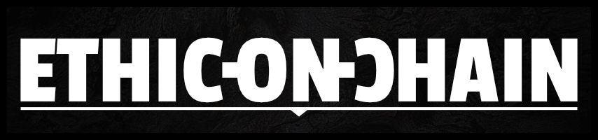

# Présentation
*Ethic-On-Chain* est une plateforme de crowdfunding de projets philanthropiques qui met en relation donateur et fondation tout en garantissant la transparence et le respect de la réglementation.

## Fonctionalités
* Gestion d'un token ERC20 "EOC" (pour Ethic On Chain)
* Création de NPO (non profit organisation)
* Création de donateur
* Création de projet rattaché au NPO
* Saisie des dons par les donateurs
* Saisie des retraits par les NPOs
* Récupération (Get) de tous les NPO ou d'un NPO en particulier
* Récupération de tous les donateurs ou d'un donateur en particulier
* Récupération de tous les projets, des projets d'un NPO ou d'un projet en particulier
* Récupération de tous les dons, des dons d'un donateur ou d'un don en particulier
* Récupération d'un retrait en particulier

## Technique
Un fichier [developer_checklist.md](developer_checklist.md) a été créé dans le but de vous donner un maximum d'informations

|ÉTAPE|FICHIER|SECTION|
|---:|:---|:---|
|Installation de la dapp|Voir [developer_checklist.md](developer_checklist.md)|Installation/validation|
|Exécution de la dapp|Voir [developer_checklist.md](developer_checklist.md)|Installation/validation|
|Lancement des tests|Voir [developer_checklist.md](developer_checklist.md)|Installation/validation|

