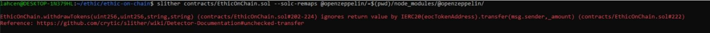

## avoiding_common_attacks.md

Les points suivants de sécurité sont issues de la [documentation Alyra](https://ecole.alyra.fr/mod/page/view.php?id=900)
TODO: tester également l'utilisation d'un outil comme [Mythril](https://github.com/ConsenSys/mythril)
TODO: tester également l'utilisation d'un outil comme [Manticore  ](https://github.com/trailofbits/manticore)

Utilisation de Slither dans notre smart contract EthicOnChain,[Slither ](https://github.com/crytic/slither),
2 erreurs ont pu être trouvé à grace à Slither qui ont pu être corrigé.

### Appel à l’inconnu - Call to the unknown

Les fonctions call et delegatecall ne sont pas utilisées. De plus il est indiqué dans la documentation "Ces deux vulnérabilités ne sont plus exploitables actuellement, en effet elles datent des débuts de Ethereum."
La fonction send n'est pas non plus utilisée et nous n'avons pas défini de fonction fallback.

### Désordre d’exception - Exception disorder

Les seules fonctions qui mettent en jeu une transaction n'ont pas d'appels croisés. Nous n'avons aucune boucle for dans le contract EthicOnChain.sol.

### Envoi sans gas - Gasless send

La fonction send n'est pas utilisée et nous n'avons pas défini de fonction fallback.

### Conversions de types - Type Casts

Les seules fonctions qui mettent en jeu une transaction n'ont pas d'appels croisés.

### Réentrance - Reentrancy 

[EthicOnChain.sol](contracts/EthicOnChain.sol), fonctions addDonation et withdrawTokens: les appels à IERC20(eocTokenAddress).transfer et trasnferFrom sont faits en dernier. Vu et vérifié par l'outil Slithissait.

### Timestamp:
Pas d'interaction avec le contrat . Pas d'utilisation du nombre de block, ou de délais dans le contrat.

### Tx.origin

Nous n'utilisons que msg.sender comme recommandé.

### Underflow / Overflow

Les risques d'underflow/overflow ont été réglé depuis Solidity 0.8 et supérieur.

## TODO : les points suivants sont à revoir pour vérifier la bonne pratique

### Contraintes de temps - time constraints

### Ether perdu lors du transfer - Ether lost in transfer

### Limite de la taille de la pile - Stack size limit

### Déni de service - DOS (Deny-of-Service)
Si besoin favoriser les paiements "pull over push".
### Déni de service avec la limite en gas du bloc

