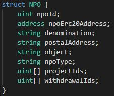
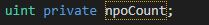
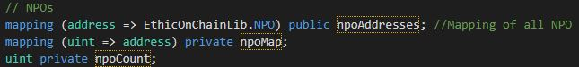

## Optimisation du code SOLIDITY
Les points suivants d'optimisation sont issues de la [documentation Alyra](https://ecole.alyra.fr/mod/page/view.php?id=899)

[Solhint ](https://github.com/protofire/solhint) nous permet de détecter différents problèmes de styling et d'optimisation.

* Regroupement des variables : les Struct sont organisées de façon à regrouper les variables de même type.
  Comme chaque emplacement de stockage coûte du gas, le regroupement des variables nous aide à optimiser notre utilisation du gas en réduisant le nombre d'emplacements requis par notre contrat.
  
  Exemple : 
  
  

* Initialisation des variables, Pas besoin d'initialiser les variables avec des valeurs par défaut

    Exemple :
    
    

* Message d'erreurs limités à l’essentiel. Exemple : "Donateur inconnu" au lieu de "Vous n'êtes pas enregistré en tant que donateur"
  
* Préférable d'utiliser un mapping plutôt qu’un tableau car moins coûteux.

  Exemple : 
  
  

  

